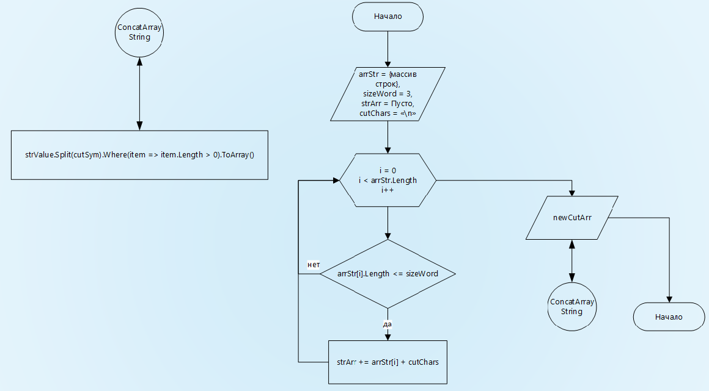

# Итоговая контрольная по курсу Разработчик

## Решение:
1. Собираем из исходного массива строк в новую строку, вставляя разделитель между элементами
2. Передаем в процедуру обработки
3. *Парсим строку* __встроенными методами строки__, учитывая разделитель и возвращаем 
## Примеры:
>["hello", "2", "world", ":-)"] -> ["2", ":-)"]

>["1234", "1567", "-2", "computer science"] -> ["-2"]

>["Russia", "Denmark", "Kazan"] -> []
## Алгоритм: 

